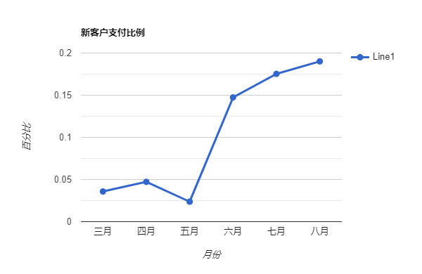

Congratulation！
**把印象笔记的所有note迁移完了**

---

上周的压力太大了，导致整个状态有点不对。
思考了一晚上，还是需要慢慢来，脚踏实地。

---

说业绩不达标，但是根据统计情况来看，数据是在向好的一面发展的。

**目前新客户的支付比例已经达到了19%**

总体数据不高是多方面的原因，比如：
- 产品淡季
- 下游需求不足
- 下游寻找到价格更低的供应商
- 外贸总体经济环境不好
- ...

确实，业绩差。但是我尽力了。

---

零售行业和批发行业，完全是雷锋和雷峰塔的区别。

想从工厂转为零售，问题非常多：
- 营销团队问题：目前除了报价，所有的任务都是由我一人来做，转零售的话，产品设计、产品定价、产品库存、打包发货、优惠搭配、这些不可能我一个人就能完成的。但是又不舍得搭建团队，也就没办法进行下去了。
- 运费问题：目前江浙那边的运费一单可以到0.9元，我们的运费一单是5元，这中间就差了4元的成本。直接导致我们的产品定价会比同类产品高4元。
- 成本问题：江浙一带很多厂使用了自动化设备，但是产品质量不如我们。导致对方的出厂价，差不多是我们的成本价。
- 定价问题：上面提到的运费问题、成本问题，直接导致了我们的定价问题。若按30的毛利，我们的产品是市面上除了进口产品以外，价格最高的产品。若降价，走薄利多销，我们的自动化设备不完善，还是需要大量的人工，产出增加，人工成本也会随之增加，到头来啥也没赚，光发工资了。
- 设计问题：目前的产品都是属于`抄袭`，也不能说是`抄袭`吧，生意人，说`借鉴`比较好听。没有设计，没所谓。但是如果抄了一个不好的设计，那也是一笔沉没成本。设计不仅仅是外观设计那么简单，还需要结合产品的实用性、当地文化、人体工学、安全等。外观好不代表是一个好产品，但卖的好的产品，一定有它好的地方，解决了某些痛点，这样这个产品才能卖得好。（当然，黑五类除外 -- 减肥、增高、丰胸、壮阳、防脱发，这些智商税不处于讨论的范畴。）
- 优惠搭配：例如外卖券、618跨店满减、这些都是需要计算得出定价和优惠的。搭配的好，可以让利润最大化，但是目前还是缺少这种能力。
- 产品库存：现在产品库存的管理法是：去货架看。有就是有，没有就是没有，看了有货再回头发，这是完全不合理的。导致整个仓库，已经堆满了，堆满的都是滞销品以及无法销售的尾单产品。又占空间，又占成本。如果有仓储管理，就不会导致货物堆积的情况。
- ...

目前1688大力推广的都是属于零售行业的工厂，反观做加工定制的工厂，特别是咱这种产品生命已经属于末期的产品，官方都无法进行扶持。只能打着给你流量的幌子，让你多交钱。

十年前的大热：
- 土木
- 自动化
- ...

今日的大热：
- AI
- 区块链
- 大数据
- 5G
- 芯片
- ...

**行业是很重要的，选错了行业，呆几十年也是白呆。唯一留下的就是一身的行业技术了，但行业都快死了，你空有技术，没有上游材料，没有下游订单，可以做什么呢？**

说是说`船到桥头自然直`，但是`船大难掉头`啊。特别是工厂这种重资产的行业，所有的设备都是为了产品去搭配的。如果产品已经死了，设备要么闲置，要么出售，不可能用现有的设备去做完全不同的另一款产品。
太难了，以后要做也是做贸易，虽然竞争大，但是压力小。 **风险也很小**。

---

现在这个情况，我觉得是有两个原因。
1. 外贸业务下滑 -> 贸易商无订单 -> 工厂无订单
2. 原料成本增加 -> 工厂必须加价保证利润 -> 贸易商换供应商 -> 工厂无订单

三大马车：
- 投资：目前还是政府主导，通过贷款启动项目，提供就业岗位，希望带动消费。我觉得，难。
- 消费：众所周知，二手房挂牌数量，开发商拿地数量，都反映了房子没人买。但是买房的钱，大家也没有拿去消费，反而都选择还贷、存款。现在银行不断地下调存款利率，美联储又不断地上调利率，导致人民币兑美元贬值，进一步影响社会投资，进而影响到老百姓。
- 出口： 目前数据依旧是下降的，并且越来越多公司迁移到东南亚。听说很多老板去了东南亚后又回来了，原因是东南亚工人有工会，并且严格执行劳动法，中国老板水土不服。太好笑了。但是你在国内的话，政府又想马儿跑，又想马儿不吃草，三天两头抓你消防和环保。隔三差五给你一个红头文件，昨天还在想今年要换什么车，今天就要考虑房是现在卖还是先贷款度日。国内的资本都不愿意投资了，何况国外的资本呢。

---

最近都开始`认房不认贷`了，也是，除了救房市，没有什么其他更好的办法。

当然也有，那就是宣布拿下tw。

我有预感，五年之内他一定会有所动作。

原因：
- 转移国内矛盾
- 收缴国内民资
- 让自己下来后不会背骂名

但是又与我现在的情况有什么关系呢？

我还是努力开发客户吧。

*2023年9月4日15:47:56 写于东莞*