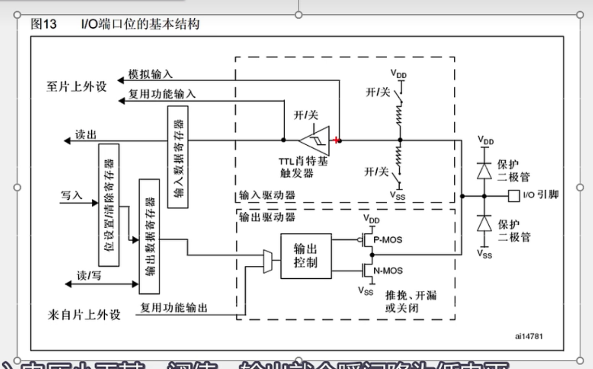

最右边为引脚。
两个保护二极管，VDD接3.3V，VSS接0V。如果流入的电压大于3.3V，会击穿VDD处的二极管，电流会顺着流出，不会流入电路中。如果流入的电压小于0V（负电压），电流会从VSS流出，不会流入电路中。

右上方，上拉电阻和下拉电阻。若接了引脚，则电平由引脚端控制；未接引脚时，由上拉电阻、下拉电阻进行控制，否则电路状态为悬空状态，容易发生改变。上拉电阻保证引脚高电平，下拉电阻保证引脚低电平（默认高低电平）。

- 施密特触发器：用于整流（整形），如果电压高于阈值，输出高电平；低于阈值，输出低电平。
- 输出控制：
	- 推挽输出（强推输出）：P-MOS和N-MOS均有效。数据寄存器为1时，上通下断，引脚接VDD，输出高电平。数据寄存器为0时，下通上断，引脚接VSS，输出低电平。
	- 开漏输出：P-MOS无效。数据寄存器为1时，下断开，输出高阻；数据寄存器为0时，下通路，输出低电平。