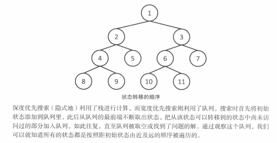
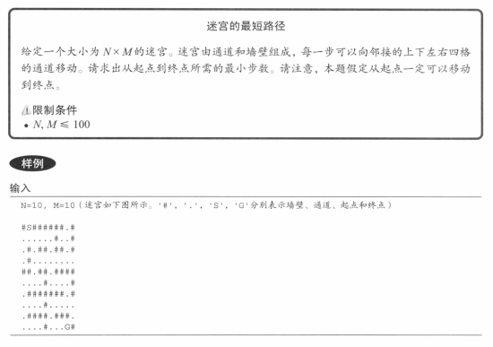

与DFS类似，从某个状态出发探索所有可以到达的状态。不同之处在于访问的顺序，BFS总是先访问距离初始状态最近的状态。也就是说：

开始 ->一次转化可以到达的状态 -> 二次转化可以到达的状态 -> ...。对于同一个状态，BFS只访问一次。复杂度为O(状态数量 * 转移方式)



eg：



代码实现：

```javascript
/**  
 * * @param {string[]} matrix  
 * @return {number} - The minimum length from start to end.  
 */function resolve(matrix) {  
  const dx = [1, 0, -1, 0]  
  const dy = [0, 1, 0, -1]  
  let startX = 0  
  let startY = 0  
  let endX = 0  
  let endY = 0  
  const iLen = matrix.length  
  const jLen = matrix[0].length  
  const queue = []  
  // 到各个位置的最短距离数组  
  const dp = new Array(iLen)  
    .fill(null)  
    .map(() => new Array(jLen).fill(undefined))  
  
  for (let i = 0; i < iLen; i++) {  
    for (let j = 0; j < jLen; j++) {  
      if (matrix[i][j] === 'S') {  
        startX = i  
        startY = j  
      }  
  
      if (matrix[i][j] === 'G') {  
        endX = i  
        endY = j  
      }  
    }  
  }  
  
  queue.push([startX, startY])  
  dp[startX][startY] = 0 // 初始化开始坐标  
  
  while (queue.length > 0) {  
    const [x, y] = queue.shift()  
  
    if (x === endX && y === endY) {  
      // 到达终点  
      break  
    }  
  
    for (let i = 0; i < 4; i++) {  
      const tempX = x + dx[i]  
      const tempY = y + dy[i]  
  
      if (  
        tempX >= 0 && // x 在范围内  
        tempX < iLen &&  
        tempY >= 0 && // y 在范围内  
        tempY < jLen &&  
        matrix[tempX][tempY] !== '#' && // 不是墙  
        dp[tempX][tempY] === undefined // 没有访问过  
      ) {  
        queue.push([tempX, tempY])  
        dp[tempX][tempY] = dp[x][y] + 1  
      }  
    }  
  }  
  
  return dp[endX][endY]  
}  
  
console.log(  
  resolve([  
    '#S######.#',  
    '......#..#',  
    '.#.##.##.#',  
    '.#........',  
    '##.##.####',  
    '....#....#',  
    '.#######.#',  
    '....#.....',  
    '.####.###.',  
    '....#...G#',  
  ]),  
)
```