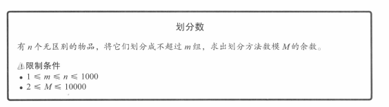
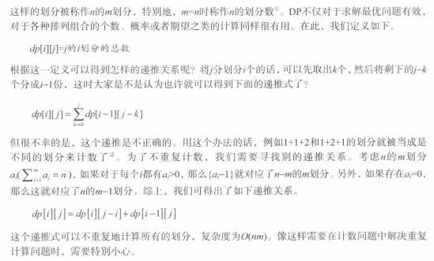

## 题目



## 分析



## 解答

```javascript
/**  
 * @param {number} n - 个数  
 * @param {number} m - 组数  
 * @param {number} mod  
 */  
function solve(n, m, mod) {  
  const dp = new Array(m + 1).fill(null).map(() => new Array(n + 1).fill(0))  
  
  dp[0][0] = 1  
  
  for (let i = 1; i <= m; i++) {  
    for (let j = 0; j <= n; j++) {  
      if (j - i >= 0) {  
        // 可以分成一组的情况  
        // (i-1,j) 上一组  
        // (i, j-i) 上一个 j-i 划分  
        dp[i][j] = (dp[i - 1][j] + dp[i][j - i]) % mod  
      } else {  
        // 不能分成一组，直接拿前一组  
        dp[i][j] = dp[i - 1][j]  
      }  
    }  }  
  console.log(dp)  
  
  return dp[m][n]  
}  
  
console.log(solve(4, 3, 10000))
```