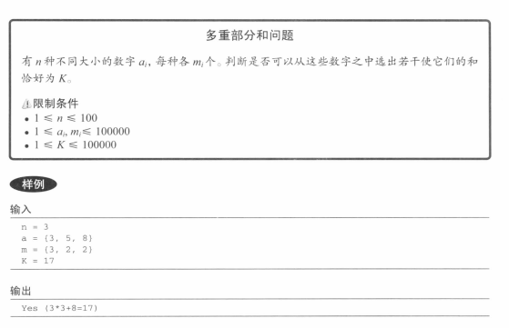

## 题目



## 分析


## 解答

```javascript
/**  
 * @param {number[]} nums - nums can use  
 * @param {number[]} times - times each num can use  
 * @param {number} target - target num  
 */function resolve(nums, times, target) {  
  const dp = new Array(target + 1).fill(-1)  
  
  dp[0] = 0  
  
  for (let i = 0, len = nums.length; i < len; i++) {  
    for (let j = 0; j <= target; j++) {  
      if (dp[j] >= 0) {  
        dp[j] = times[i]  
      } else if (j < nums[i] || dp[j - nums[i]] <= 0) {  
        dp[j] = -1  
      } else {  
        dp[j] = dp[j - nums[i]] - 1  
      }  
    }  }  
  if (dp[target] >= 0) {  
    return 'Yes'  
  }  
  
  return 'No'  
}  
  
console.log(resolve([3, 5, 8], [3, 2, 2], 17))
```