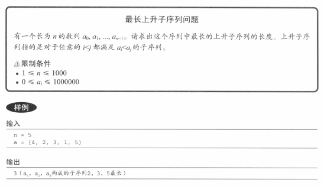
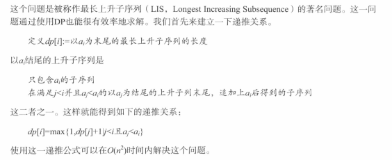
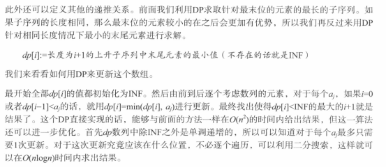

## 题目



## 分析




## 解答

```javascript
/**  
 * @param {number[]} nums  
 */  
function solve(nums) {  
  let res = 0  
  const len = nums.length  
  const dp = new Array(len)  
  for (let i = 0; i < len; i++) {  
    dp[i] = 1  
    for (let j = 0; j < i; j++) {  
      // 从前往后遍历  
      if (nums[j] < nums[i]) {  
        // 位置 i 的长度为 max（当前长度， 前一个位置长度+1）  
        dp[i] = Math.max(dp[i], dp[j] + 1)  
      }  
  
      // 更新 max      res = Math.max(dp[i], res)  
    }  
  }  
  return res  
}
```