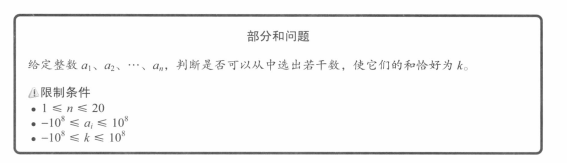
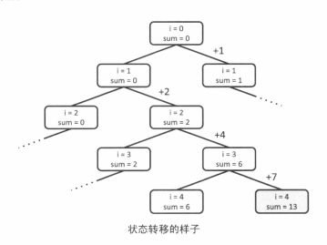
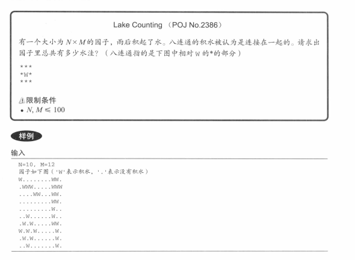

某个状态开始，不断地转移状态，直到状态无法转移，然后退回到前一个状态，继续转移其他状态。如此不断重复，直到找到最终解。根据DFS的特点，使用递归实现比较简单。

eg：



每一个分量都可以分为加与不加两种状态。



代码实现：

```javascript
/**  
 * * @param {number[]} arr  
 * @param {number} target  
 * @return {boolean}  
 */  
function test(arr, target) {  
  const len = arr.length  
  
  /**  
   * @param {number} index - Current index.  
   * @param {number} sum - Current sum.  
   */  function dfs(index, sum) {  
    if (index === len) return sum === target  
  
    if (dfs(index + 1, sum)) return true // If is target when without current val.  
    if (dfs(index + 1, sum + arr[index])) return true // If is target when with current val.  
  
    return false  
  }  
  
  return dfs(0, 0)  
}  
  
console.log(test([1, 2, 4, 7], 15))
```
  
eg2:



代码实现：

```javascript
/**  
 * * @param {string[][]} water  
 */  
function test(water) {  
  let result = 0  
  const row = water.length  
  const col = water[0].length  
  
  /**  
   * @param {number} x  
   * @param {number} y  
   */  
  function dfs(x, y) {  
    water[x][y] = '.'  
  
    for (let dx = -1; dx <= 1; dx++) {  
      for (let dy = -1; dy <= 1; dy++) {  
        const xp = x + dx  
        const yp = y + dy  
  
        if (  
          xp >= 0 &&  
          xp < row &&  
          yp >= 0 &&  
          yp < col &&  
          water[xp][yp] === 'w'  
        ) {  
          dfs(xp, yp)  
        }  
      }  
    }  
  }  
  
  /**  
   * Print the `water` with beauty format.   */  function print() {  
    console.log('-------------------------')  
    for (let i = 0; i < row; i++) console.log(water[i].join(','))  
    console.log('-------------------------')  
  }  
  
  for (let i = 0; i < row; i++) {  
    for (let j = 0; j < row; j++) {  
      if (water[i][j] === 'w') {  
        print()  
        dfs(i, j)  
        result++  
      }  
    }  
  }  
  
  return result  
}  
  
console.log(  
  test([  
    ['w', '.', '.', '.', '.', '.', '.', '.', '.', 'w', 'w', '.'],  
    ['.', 'w', 'w', 'w', '.', '.', '.', '.', '.', 'w', 'w', 'w'],  
    ['.', '.', '.', '.', 'w', 'w', '.', '.', '.', 'w', 'w', '.'],  
    ['.', '.', '.', '.', '.', '.', '.', '.', '.', 'w', 'w', '.'],  
    ['.', '.', '.', '.', '.', '.', '.', '.', '.', 'w', '.', '.'],  
    ['.', '.', 'w', '.', '.', '.', '.', '.', '.', 'w', '.', '.'],  
    ['.', 'w', '.', 'w', '.', '.', '.', '.', '.', 'w', 'w', '.'],  
    ['w', '.', 'w', '.', 'w', '.', '.', '.', '.', '.', 'w', '.'],  
    ['.', 'w', '.', 'w', '.', '.', '.', '.', '.', '.', 'w', '.'],  
    ['.', '.', 'w', '.', '.', '.', '.', '.', '.', '.', 'w', '.'],  
  ]),  
)
```