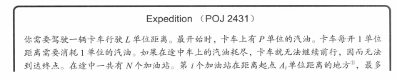
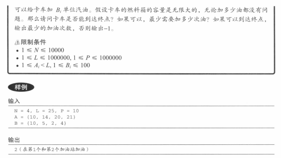
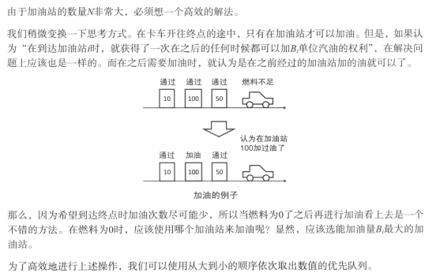

## 题目




## 分析



## 解答

```javascript
const MaxHeap = require('./template/maxheap')  
  
/**  
 * @param {number} init  
 * @param {number} target  
 * @param {number[]} A  
 * @param {number[]} B  
 * @return {number} - 加油次数  
 */  
function solve(init, target, A, B) {  
  /**  
   * 终点也设置为加油站  
   */  
  A[A.length] = target  
  B[B.length] = 0  
  
  /**  
   * priority_queue 优先队列  
   * @type {MaxHeap}  
   */  
  const heap = new MaxHeap()  
  
  /**  
   * 加油次数  
   * @type {number}  
   */  
  let res = 0  
  
  /**  
   * 当前位置  
   * @type {number}  
   */  
  let position = 0  
  
  /**  
   * 剩余汽油量  
   * @type {number}  
   */  
  let currentP = init  
  
  for (let i = 0, len = A.length; i < len; i++) {  
    /**  
     * 下一个位置  
     * @type {number}  
     */  
    let delta = A[i] - position  
  
    /**  
     * 油量不足以到这个加油站时  
     */  
    while (currentP - delta < 0) {  
      if (heap.empty()) {  
        return -1  
      }  
  
      currentP += heap.top()  
      heap.delete()  
      res++  
    }  
  
    currentP -= delta  
    position = A[i]  
    heap.insert(B[i])  
  }  
  
  return res  
}  
  
console.log(solve(10, 25, [10, 14, 20, 21], [10, 5, 2, 4]))
```