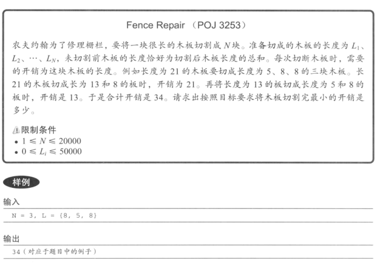
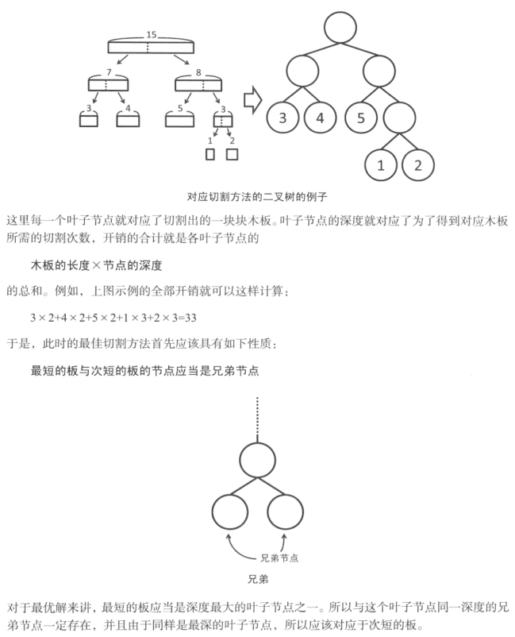
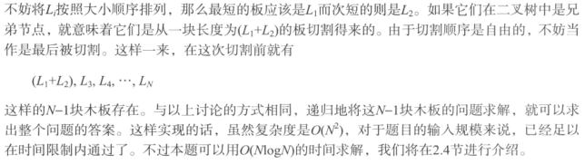

分析思路：





代码实现：

```javascript
/**  
 * @param {number[]} woods  
 * @return {number} - Times need to be cut.  
 */function resolve(woods) {  
  let len = woods.length  
  let result = 0  
  
  while (len > 1) {  
    let min1 = 0  
    let min2 = 1  
  
    if (woods[min1] > woods[min2]) {  
      // swap the min one  
      ;[woods[min1], woods[min2]] = [woods[min2], woods[min1]]  
    }  
  
    for (let i = 2; i < len; i++) {  
      // update the min 2  
      if (woods[i] < woods[min1]) {  
        min2 = min1  
        min1 = i  
      } else if (woods[i] < woods[min2]) {  
        min2 = i  
      }  
    }  
  
    const val = woods[min1] + woods[min2]  
    result += val  
  
    if (min1 === len - 1) {  
      // the last one  
      ;[woods[min1], woods[min2]] = [woods[min2], woods[min1]]  
    }  
  
    woods[min1] = val  
    woods[min2] = woods[len - 1] // delete the last one  
  
    len--  
  }  
  
  return result  
}  
  
console.log(resolve([8, 5, 8]))
```