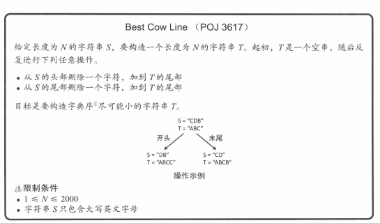
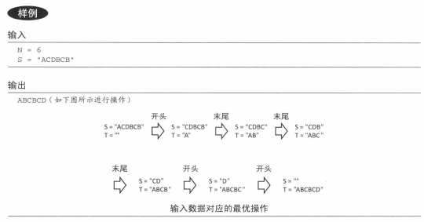

代码实现：  

```javascript
/**  
 * @param {string} s - Original string.  
 * @return {string} - Result.  
 */function resolve(s) {  
  const result = []  
  
  let left = 0  
  let right = s.length - 1  
  
  while (left <= right) {  
    let flag = false // is less from left to right  
  
    for (let i = 0; i + left <= right; i++) {  
      if (s[left + i] < s[right - i]) {  
        // is less from left to right  
        flag = true  
        break      } else if (s[left + i] > s[right - i]) {  
        // is less from right to left  
        flag = false  
        break      }  
    }  
  
    if (flag) result.push(s[left++])  
    else result.push(s[right--])  
  }  
  
  return result.join('')  
}  
  
console.log(resolve('acdbcb'))
```