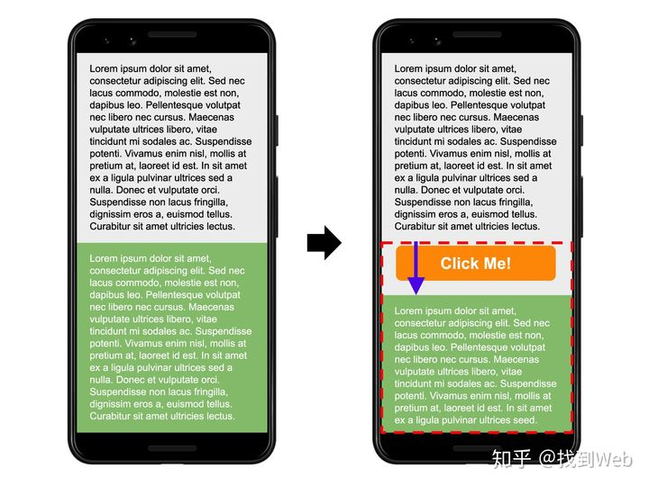
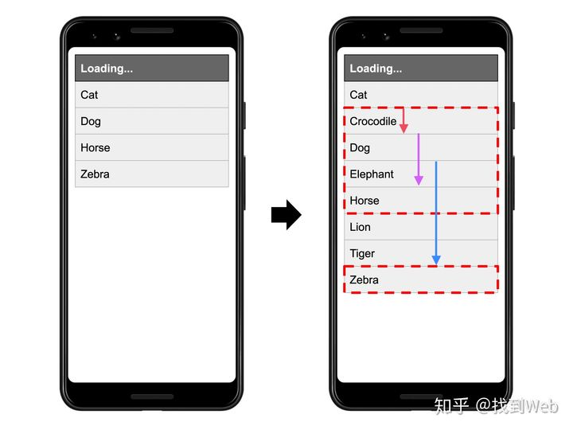

## 什么是CLS？

`CLS` 是所有布局偏移分数的汇总，凡是在页面完整生命周期内预料之外的布局偏移都包括。

布局偏移发生在任意时间，当一个可见元素改变了它的位置，从一个渲染帧到下一个。


## 什么是一个好的CLS分数？

75%以上的用户小于0.1。

## 布局偏移的具体内容

布局偏移是由 [Layout Instability API](https://link.zhihu.com/?target=https%3A//github.com/WICG/layout-instability) 定义的。这个API会在任意时间上报 `layout-shift` 的条目，当一个可见元素在两帧之间，改变了它的起始位置（默认的 [writing mode](https://link.zhihu.com/?target=https%3A//developer.mozilla.org/en-US/docs/Web/CSS/writing-mode) 下指的是top和left属性）。这些元素被当成不稳定元素。

需要注意的是，布局偏移只发生在已经存在的元素改变起始位置的时候。如果一个新的元素被添加到dom上，或者已存在的元素改变它的尺寸，除非改变了其他元素的起始位置，否则都不算布局偏移。

### 布局偏移分数

为了计算布局偏移分数，浏览器看的是视图尺寸和两帧之间不稳定元素的移动。布局偏移的分数是两个度量的乘积：影响分数(impact fraction)和距离分数(distance fraction)。

```
layout shift score = impact fraction * distance fraction
```

> 为什么是两个度量的乘积？因为如果是一个很大的元素移动了较小的距离，实际影响并不大，所以分数需要依赖两个度量。

### 影响分数

影响分数测试的是两帧之间，不稳定元素在视图上的影响范围。

包含前后两帧，不稳定元素的可见区域的总和除以总的视图大小，就是当前帧的影响分数。


上图中，元素在一帧中占了屏幕的一半。下一帧，元素下移了25%的视图高度。红色虚线框起来的部分就是不稳定元素在两帧的占的视图总和（75%），所以影响分数是0.75。

### 距离分数

距离分数测试的是两帧之间，不稳定元素在视图上移动的距离（水平和纵向取最大值）。如果有多个不稳定元素，也是取其中最大的一个。

上面的例子，不稳定元素在纵向移动了25%，所以距离分数是0.25。

所以布局偏移分数是 `0.75 * 0.25 = 0.1875` 。

下一个例子是在已存在的元素中插入一个新的元素，计算布局偏移分数:



"Click Me!"按钮被插入到灰色盒子下方，把绿色盒子往下推了。  

在这个例子中，灰色盒子只是改变了尺寸，所以不算不稳定元素。

"Click Me!"按钮因为是新插入的元素，所以也不算不稳定元素。

绿色盒子的起始位子改变了，但因为部分区域不在视图内，不在视图内的区域不算入影响分数，所以影响分数是0.5。

距离分数是蓝色尖头的部分，绿色盒子往下移动了14%，所以距离分数是0.14。

布局偏移分数是 `0.5 * 0.14 = 0.07` 。

最后一个例子是多个不稳定元素:



第一帧中，API结果返回了4个，按字母序排列。第二帧返回了更多，同样的是字母序。

第一个元素 "Cat" 前后没有改变起始位子，所以是稳定的。同样，新加入的元素，也是稳定的。只有 "Dog", "Horse", "Zebra" 这三个元素改变了起始位子，是不稳定元素。

红色虚线框起来的部分就是影响分数，表示所有不稳定元素可见区域占视图的比例，大概是0.38。

蓝色箭头所指的就是距离分数，因为这是所有不稳定元素中最大的移动距离，大概是0.3。

布局偏移分数是 `0.38 x 0.3 = 0.1172` 。

### 预料 vs 预料之外的布局偏移

并非所有布局偏移都是不好的。实际上，很多动态web应用经常性的改变元素的起始位置。

### 用户启动的布局偏移

用户预料之外的布局偏移才是不好的。换句话说，如果是为了响应用户的交互而产生的布局偏移通常是很好的。只要布局偏移与用户交互足够紧密，这两者之间的关系对用户而言是很明确的。

例如，用户触发了一个网络请求，可能需要花一段时间才能结束，最好的做法是创造一些空白区域或者展示loading，避免请求结束后的预料之外的布局偏移。如果用户没有意识到正在加载数据，或者不知道资源是否加载完成，他们在等待的过程中会点击某些元素，这些元素后面可能会移动到了下方，就跟文章开头的图一样。

布局偏移如果发生在用户输入之后的500ms内，会有一个 `hadRecentInput` 的标记，这样就可以被排除在外。

### 动画和过渡

动画和过渡，如果做得好，对用户而言是一个不错的更新内容的方式，这样不会给用户“惊喜”。突然出现的或者预料之外的内容，会给用户一个很差的体验。但如果是一个动画或者过渡，用户可以很清楚的知道发生了什么，在状态变化的时候可以很好的引导用户。

CSS中的 `transform` 属性可以让你在使用动画的时候不会产生布局偏移。

- 用 `transform:scale()` 来替换 `width` 和 `height` 属性
- 用 `transform:translate()` 来替换 `top`, `left`, `bottom`, `right` 属性

## 如何测试CLS？

可以集成 [web-vitals](https://link.zhihu.com/?target=https%3A//github.com/GoogleChrome/web-vitals) 的库，代码如下:

```
import {getCLS} from 'web-vitals';

// Measure and log the current CLS value,
// any time it's ready to be reported.
getCLS(console.log);
```

CLS是所有独立的 `layout-shift` 条目的汇总（排除掉用户输入近期的条目）。

比起统计每一个 `layout-shift` 条目，在页面隐藏之后，统计一个CLS的总分更合适。

## 如何改善CLS？

对大部分网站而言，可以参考以下:

- 对图片和视频元素总是设定好尺寸，否则保留所需的空间。这样可以保证浏览器给这些元素分配足够的空间，在加载之后，不会产生布局偏移。如果浏览器支持，可以开启 `unsized-media feature policy` 的策略。
- 永远不要把内容插入到已有元素的上方，除非为了响应用户交互。
- 如果需要用到动画，优先使用不会产生布局偏移的CSS属性。

更多CLS优化可以期待后面的文章。

## 总结

CLS是平时开发很少关注的点，页面视觉稳定性对很多web开发而言，可能没有加载性能那么关注度高，但对用户而言，这确实是很困扰的一点。平时开发中，尽可能的提醒自己，不管是产品交互图出来之后，或者是UI的视觉稿出来之后，如果出现了布局偏移的情况，都可以提出这方面的意见。开发过程中也尽可能的遵循上面提到的一些优化点，给用户一个稳定的视觉体验。