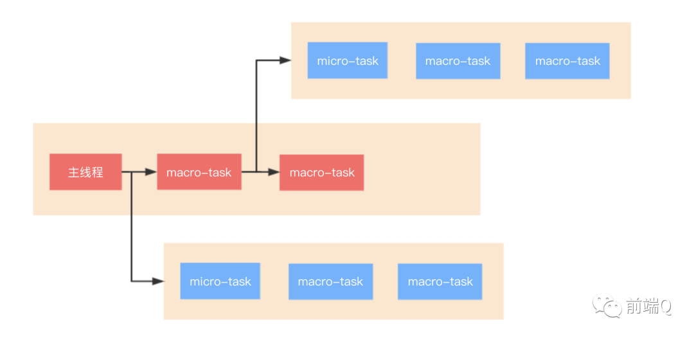
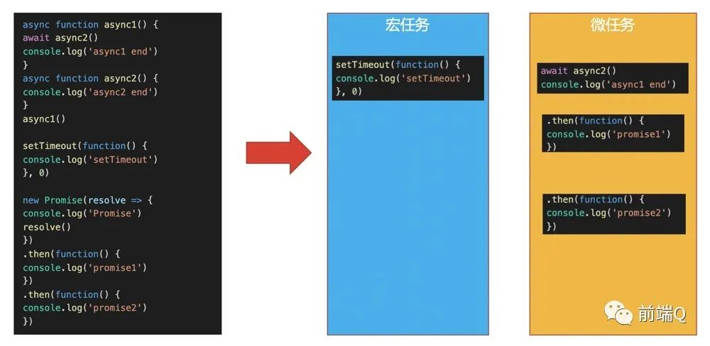

**浏览器中的事件循环**

JavaScript代码的执行过程中，除了依靠函数调用栈来搞定函数的执行顺序外，还依靠任务队列(task queue)来搞定另外一些代码的执行。整个执行过程，我们称为事件循环过程。一个线程中，事件循环是唯一的，但是任务队列可以拥有多个。任务队列又分为macro-task（宏任务）与micro-task（微任务），在最新标准中，它们被分别称为task与jobs。  

macro-task大概包括：

- script（整体代码）
- setTimeout
- setInterval
- setImmediate
- I/O
- UI render

micro-task大概包括：

- process.nextTick
- Promise
- async/await（还是Promise）
- MutationObserver（HTML5）

整体流程大概为：



执行macro-task，然后执行该任务产生的micro-task，若micro-task在执行过程中新生成了micro-task，则继续执行micro-task。直到无micro-task，返回macro-task，进行event loop。



答案为：

1. async2 end  
2. Promise
3. async1 end
4. promise1
5. promise2
6. setTimeout

**async/await 执行顺序**

我们知道async隐式返回Promise函数，可以理解为await后的语句执行结束后，await产生一个micro-task。但是时机在与执行完await后的语句之后，会暂停当前执行，转而执行其他loop。然后按照micro-task的注册顺序，继续执行。最后进入下一个macro-task。

**Node和Browser的EentLoop差异**

- Browser中的micro-task是在每个相应的macro-task中执行的。
- NodeJS中的micro-task是在不同阶段中执行的。

**NodeJS版本差异**  

NodeJS11之后，会在执行一个macro-task之后立即执行他的micro-task队列。

```javascript
setTimeout(()=>{  
  console.log('timer1')  
  Promise.resolve().then(function() {  
    console.log('promise1')  
  })  
}, 0)  
setTimeout(()=>{  
  console.log('timer2')  
  Promise.resolve().then(function() {  
    console.log('promise2')  
  })  
}, 0)
```

- node11之前：timer1 -> timer2 -> promise1 -> promise2
- node11之后：timer1 -> promise1 -> timer2 -> promise2