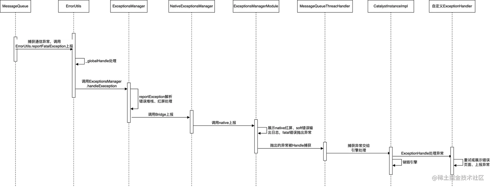

### 来源

引用自 https://juejin.cn/post/7204756153414041637

### Javascript Error

#### Syntax Error 语法错误

- 词法、语法分析转换生成语法树时发生，此类异常一旦发生，导致整个 js 文件无法执行： `const 1xx`
- runtime error：`JSON.parse('')`

#### Reference Error 引用错误

`const a = xxx; // ReferenceError: xxx is not defined`

#### Type Error 类型错误

```javascript
1() // TypeError: 1 is not a function
const a = new 111() // TypeError: 111 is not a constructor
```

#### Range Error 边界错误

```javascript
;[].length = -1 // RangeError: Invalid array length
```

#### URI Error

调用 URI 相关函数中出现，包括 encodeURI、decodeURI()、encodeURIComponent()、decodeURIComponent()、escape()和 unescape()

```javascript
decodeURI('%') // URIError: URI malformed
```

#### 自定义错误

继承 Error 实现

```javascript
class MyError extends Error {
  constructor(message) {
    super(message);
    this.name = 'MyError';
  }
}

function() {
 throw new MyError('error message'); // MyError: error message
}
```

### React-Native 中错误处理

错误处理包括 JS 和 native 两部分，由 JS 捕获，抛给 Native 处理

#### JS 部分

##### MessageQueue 消息队列

Native 和 JS 通信的消息队列, 负责 Native 和 JS 通讯, 包括渲染、交互、各种互相调用等。所有的通信都会经过\_guard 函数处理，在\_guard 中会被 try-catch 住，出现异常后调用 ErrorUtils 处理

```javascript
// react-native/Libraries/BatchedBridge/MessageQueue.js
__guard(fn: () => void) {
  if (this.__shouldPauseOnThrow()) {
    fn();
  } else {
    try {
      fn();
    } catch (error) {
      ErrorUtils.reportFatalError(error); // 捕获异常，交给ErrorUtils
    }
  }
}
```

##### ErrorUtils

ErrorUtils 用于处理 RN 中所有的异常，它对暴露异常处理拦截接口

**异常上报**
收到异常后调用\_globalHandler 处理异常

```javascript
// 处理非fatal异常
reportError(error: mixed): void {
  _globalHandler && _globalHandler(error, false);
},

// 处理fatal异常
reportFatalError(error: mixed): void {
  _globalHandler && _globalHandler(error, true);
},
```

**异常处理**
所有异常通过\_globalHandle 函数处理，默认情况下\_globalHandler 会直接将错误抛出，ErrorUtils 对外提供了 setGlobalHanlder 做错误拦截处理，RN 重写\_globalHandler 来做错误收集和处理

```javascript
// react-native/Libraries/polyfills/error-guard.js
let _globalHandler: ErrorHandler = function onError(
  e: mixed,
  isFatal: boolean,
) {
  throw e;
};

setGlobalHandler(fun: ErrorHandler): void {
  _globalHandler = fun;
},

getGlobalHandler(): ErrorHandler {
  return _globalHandler;
},
```

##### ExceptionsManager

ExceptionsManager 是 RN 中异常管理模块，负责红屏处理、console.error、并将异常传给 Native 侧

**异常处理器设置**

- 调用 ErrorUtils.setGlobalHandler，把错误处理实现交给 ExceptionsManager.handleException
- console.error 处理：调用 ExceptionsManager.installConsoleErrorReporter 重写 console.error

```javascript
// react-native/Libraries/Core/setUpErrorHandling.js
const ExceptionsManager = require('./ExceptionsManager')
// Set up console.error handler
ExceptionsManager.installConsoleErrorReporter()

// Set up error handler
if (!global.__fbDisableExceptionsManager) {
  const handleError = (e, isFatal) => {
    try {
      ExceptionsManager.handleException(e, isFatal)
    } catch (ee) {
      console.log('Failed to print error: ', ee.message)
      throw e
    }
  }

  const ErrorUtils = require('../vendor/core/ErrorUtils')
  ErrorUtils.setGlobalHandler(handleError)
}
```

**ExceptionsManager 处理异常**

- 构建 Error：如果错误不是 Error 类型，构造一个 SyntheticError，方便日志输出和展示
- 调用错误处理
- NativeExceptionsManager 调用 native 模块上报错误

```javascript
function handleException(e: mixed, isFatal: boolean) {
  let error: Error
  if (e instanceof Error) {
    error = e
  } else {
    error = new SyntheticError(e)
  }
  reportException(error, isFatal)
}

function reportException(e: ExtendedError, isFatal: boolean) {
  const NativeExceptionsManager = require('./NativeExceptionsManager').default
  if (NativeExceptionsManager) {
    // 解析错误，获取错误信息、堆栈
    const parseErrorStack = require('./Devtools/parseErrorStack')
    const stack = parseErrorStack(e)
    const currentExceptionID = ++exceptionID
    const originalMessage = e.message || ''
    let message = originalMessage
    if (e.componentStack != null) {
      message += `\n\nThis error is located at:${e.componentStack}`
    }
    const namePrefix = e.name == null || e.name === '' ? '' : `${e.name}: `
    const isFromConsoleError = e.name === 'console.error'
    if (!message.startsWith(namePrefix)) {
      message = namePrefix + message
    }

    // 如果是console.error则输出
    if (!isFromConsoleError) {
      if (console._errorOriginal) {
        console._errorOriginal(message)
      } else {
        console.error(message)
      }
    }

    message =
      e.jsEngine == null ? message : `${message}, js engine: ${e.jsEngine}`
    // 抑制（不展示）红屏，不展示native红屏弹窗，forceRedbox默认为false
    const isHandledByLogBox =
      e.forceRedbox !== true && global.__unstable_isLogBoxEnabled === true
    const data = preprocessException({
      message,
      originalMessage: message === originalMessage ? null : originalMessage,
      name: e.name == null || e.name === '' ? null : e.name,
      componentStack:
        typeof e.componentStack === 'string' ? e.componentStack : null,
      stack,
      id: currentExceptionID,
      isFatal,
      extraData: {
        jsEngine: e.jsEngine,
        rawStack: e.stack,

        // Hack to hide native redboxes when in the LogBox experiment.
        // This is intentionally untyped and stuffed here, because it is temporary.
        suppressRedBox: isHandledByLogBox,
      },
    })

    // 如果抑制native红屏，展示JS红屏提示错误
    if (isHandledByLogBox) {
      LogBoxData.addException({
        ...data,
        isComponentError: !!e.isComponentError,
      })
    }

    // 把调用NativeExceptionsManager上报给native
    NativeExceptionsManager.reportException(data)
  }
}

// Native导出类，以Android为例，对应ExceptionsManagerModule.java
const NativeModule = TurboModuleRegistry.getEnforcing<Spec>(
  'ExceptionsManager',
);

const ExceptionsManager{
  // 判断是否是fatal调用不同函数上报
	reportException(data: ExceptionData): void {
    if (data.isFatal) {
      ExceptionsManager.reportFatalException(data.message, data.stack, data.id);
    } else {
      ExceptionsManager.reportSoftException(data.message, data.stack, data.id);
    }
  },

  // 上报fatal异常
 	reportFatalException(
    message: string,
    stack: Array<StackFrame>,
    exceptionId: number,
  ) {
    NativeModule.reportFatalException(message, stack, exceptionId);
  },

  // 上报soft异常
	reportSoftException(
    message: string,
    stack: Array<StackFrame>,
    exceptionId: number,
  ) {
    NativeModule.reportSoftException(message, stack, exceptionId);
  },

  // Android提供关闭红屏函数
	dismissRedbox(): void {
    if (Platform.OS !== 'ios' && NativeModule.dismissRedbox) {
      // TODO(T53311281): This is a noop on iOS now. Implement it.
      NativeModule.dismissRedbox();
    }
  },
}
```

**console.error 处理**
调用 ExceptionsManager.installConsoleErrorReporter 处理 console.error，处理成非 fatal 异常

```javascript
// react-native/Libraries/Core/ExceptionsManager.js
function installConsoleErrorReporter() {
  // 如果设置过，return
  if (console._errorOriginal) {
    return // already installed
  }
  console._errorOriginal = console.error.bind(console)
  // 设置console.error处理函数
  console.error = reactConsoleErrorHandler
  if (console.reportErrorsAsExceptions === undefined) {
    console.reportErrorsAsExceptions = true
  }
}

// console.error处理函数，最终调用reportException上报成非fatal异常
function reactConsoleErrorHandler() {
  if (arguments[0] && arguments[0].stack) {
    // 上报
    reportException(arguments[0], /* isFatal */ false)
  } else {
    // 构造一个SyntheticError
    const stringifySafe = require('../Utilities/stringifySafe')
    const str = Array.prototype.map
      .call(arguments, (value) =>
        typeof value === 'string' ? value : stringifySafe(value),
      )
      .join(' ')
    const error: ExtendedError = new SyntheticError(str)
    error.name = 'console.error'
    // 上报
    reportException(error, /* isFatal */ false)
  }
}
```

**跟进上述源码可知，通过 isHandledByLogBox 参数可以禁止 native 红屏弹窗，isHandledByLogBox 是通过 global.\_\_unstable_isLogBoxEnabled 控制，可以通过下面方式禁止 native 红屏展示，但是还是会展示 js 红屏来提示错误**

```javascript
global.__unstable_isLogBoxEnabled = true
YellowBox.__unstable_enableLogBox() // 内部调用了上面的代码
```

#### Native 部分

##### ExceptionsManagerModule

ExceptionsManagerModule 是 native 处理异常模块，导出给 JS 类名为 ExceptionsManager

```java
// 上报fatal异常
@ReactMethod
public void reportFatalException(String message, ReadableArray stack, int id) {
    JavaOnlyMap data = new JavaOnlyMap();
    data.putString("message", message);
    data.putArray("stack", stack);
    data.putInt("id", id);
    data.putBoolean("isFatal", true);
    reportException(data);
}

// 上报soft异常
@ReactMethod
public void reportSoftException(String message, ReadableArray stack, int id) {
    JavaOnlyMap data = new JavaOnlyMap();
    data.putString("message", message);
    data.putArray("stack", stack);
    data.putInt("id", id);
    data.putBoolean("isFatal", false);
    reportException(data);
}

// 最终调用reportException
@ReactMethod
public void reportException(ReadableMap data) {
  	// 错误堆栈
    String message = data.hasKey("message") ? data.getString("message") : "";
    ReadableArray stack = data.hasKey("stack") ? data.getArray("stack") : Arguments.createArray();
    int id = data.hasKey("id") ? data.getInt("id") : -1;
    boolean isFatal = data.hasKey("isFatal") ? data.getBoolean("isFatal") : false;

  	// dev模式，展示红屏dialog
    if (mDevSupportManager.getDevSupportEnabled()) {
      // 获取是否抑制红屏参数，对应js侧传入的isHandledByLogBox
      boolean suppressRedBox = false;
      if (data.getMap("extraData") != null && data.getMap("extraData").hasKey("suppressRedBox")) {
        suppressRedBox = data.getMap("extraData").getBoolean("suppressRedBox");
      }

      if (!suppressRedBox) {
        mDevSupportManager.showNewJSError(message, stack, id); // 显示红屏弹窗
      }
    } else {
			// fatal抛出JavascriptException异常，非fatal打印出来
      if (isFatal) {
        throw new JavascriptException(jsStackTrace)
          .setExtraDataAsJson(extraDataAsJson);
      } else {
        logException(jsStackTrace, extraDataAsJson);
      }
    }
}

@ReactMethod
public void dismissRedbox() {
    if (mDevSupportManager.getDevSupportEnabled()) {
      mDevSupportManager.hideRedboxDialog();
    }
}
```

```objective-c
// 上报soft异常
- (void)reportSoft: (NSString *)message stack:(NSArray<NSDictionary *> *)stack exceptionId:(double)exceptionId suppressRedBox: (BOOL) suppressRedBox {
    if (!suppressRedBox) {
        [_bridge.redBox showErrorMessage:message withStack:stack errorCookie:((int)exceptionId)];
    }

    if (_delegate) {
      [_delegate handleSoftJSExceptionWithMessage:message stack:stack exceptionId:[NSNumber numberWithDouble:exceptionId]];
    }
}
// 上报fatal异常
- (void)reportFatal: (NSString *)message stack:(NSArray<NSDictionary *> *)stack exceptionId:(double)exceptionId suppressRedBox: (BOOL) suppressRedBox {
    if (!suppressRedBox) {
        [_bridge.redBox showErrorMessage:message withStack:stack errorCookie:((int)exceptionId)];
    }

    if (_delegate) {
      [_delegate handleFatalJSExceptionWithMessage:message stack:stack exceptionId:[NSNumber numberWithDouble:exceptionId]];
    }

    static NSUInteger reloadRetries = 0;
    if (!RCT_DEBUG && reloadRetries < _maxReloadAttempts) {
      reloadRetries++;
      RCTTriggerReloadCommandListeners(@"JS Crash Reload");
    } else if (!RCT_DEV || !suppressRedBox) {
      NSString *description = [@"Unhandled JS Exception: " stringByAppendingString:message];
      NSDictionary *errorInfo = @{ NSLocalizedDescriptionKey: description, RCTJSStackTraceKey: stack };
      RCTFatal([NSError errorWithDomain:RCTErrorDomain code:0 userInfo:errorInfo]);
    }
}
// reportException
RCT_EXPORT_METHOD(reportException:(JS::NativeExceptionsManager::ExceptionData &)data)
{
  NSString *message = data.message();
  double exceptionId = data.id_();
  id<NSObject> extraData = data.extraData();

  // Reserialize data.stack() into an array of untyped dictionaries.
  // TODO: (moti) T53588496 Replace `(NSArray<NSDictionary *> *)stack` in
  // reportFatalException etc with a typed interface.
  NSMutableArray<NSDictionary *> *stackArray = [NSMutableArray<NSDictionary *> new];
  for (auto frame: data.stack()) {
    NSMutableDictionary * frameDict = [NSMutableDictionary new];
    if (frame.column().hasValue()) {
      frameDict[@"column"] = @(frame.column().value());
    }
    frameDict[@"file"] = frame.file();
    if (frame.lineNumber().hasValue()) {
        frameDict[@"lineNumber"] = @(frame.lineNumber().value());
    }
    frameDict[@"methodName"] = frame.methodName();
    if (frame.collapse().hasValue()) {
        frameDict[@"collapse"] = @(frame.collapse().value());
    }
    [stackArray addObject:frameDict];
  }
  NSDictionary *dict = (NSDictionary *)extraData;
  BOOL suppressRedBox = [[dict objectForKey:@"suppressRedBox"] boolValue];

  if (data.isFatal()) {
    [self reportFatal:message stack:stackArray exceptionId:exceptionId suppressRedBox:suppressRedBox];
  } else {
    [self reportSoft:message stack:stackArray exceptionId:exceptionId suppressRedBox:suppressRedBox];
  }
}
```

**DevSupportManager 处理红屏**

```java
@Override
  public void showNewJavaError(@Nullable String message, Throwable e) {
    FLog.e(ReactConstants.TAG, "Exception in native call", e);
    showNewError(
        message, StackTraceHelper.convertJavaStackTrace(e), JAVA_ERROR_COOKIE, ErrorType.NATIVE);
  }

// 展示红屏弹窗
private void showNewError(
      @Nullable final String message,
      final StackFrame[] stack,
      final int errorCookie,
      final ErrorType errorType) {
    UiThreadUtil.runOnUiThread(
        new Runnable() {
          @Override
          public void run() {
            if (mRedBoxDialog == null) {
              Activity context = mReactInstanceManagerHelper.getCurrentActivity();
              mRedBoxDialog = new RedBoxDialog(context, DevSupportManagerImpl.this, mRedBoxHandler);
            }
            if (mRedBoxDialog.isShowing()) {
              return;
            }
            Pair<String, StackFrame[]> errorInfo = processErrorCustomizers(Pair.create(message, stack));
            mRedBoxDialog.setExceptionDetails(errorInfo.first, errorInfo.second);
            mRedBoxDialog.resetReporting();
            mRedBoxDialog.show();
          }
        });
  }
```

##### 线程异常捕获（Android）

**Handle 捕获异常**
RN 引擎创建的时候会初始化三个线程，UiThread、NativeModulesThread、JSThread，这些线程通过 MessageQueueThreadHandler 处理消息队列，MessageQueueThreadHandler 重写了 Handle 的 dispatchMessage 函数，函数通过 try-catch 包裹防止应用直接退出，出现异常时调用 QueueThreadExceptionHandler 处理（引擎实现此接口），这里能拦截所有的异常，包括上述 js 捕获传到 native 手动抛出的、yoga 布局过程中的等等。

```java
public class MessageQueueThreadHandler extends Handler {
  private final QueueThreadExceptionHandler mExceptionHandler;
  public MessageQueueThreadHandler(Looper looper, QueueThreadExceptionHandler exceptionHandler) {
    super(looper);
    mExceptionHandler = exceptionHandler;
  }

  @Override
  public void dispatchMessage(Message msg) {
    try {
      super.dispatchMessage(msg);
    } catch (Exception e) {
      mExceptionHandler.handleException(e);
    }
  }
}
```

**引擎处理异常**
在引擎（CatalystInstanceImpl）的内部类 NativeExceptionHandler 中，实现了 QueueThreadExceptionHandler 接口，在引擎创建时初始化，出现异常时调用 NativeModuleCallExceptionHandler 处理，并销毁引擎。

```java
// com.facebook.react.bridge.CatalystInstanceImpl（引擎实现类）
// 内部类实现QueueThreadExceptionHandler，叫异常交给引擎的onNativeException处理
private static class NativeExceptionHandler implements QueueThreadExceptionHandler {
    @Override
    public void handleException(Exception e) {
      if (ReactFeatureFlags.enableCatalystCleanupFix) {
        CatalystInstanceImpl catalystInstance = mCatalystInstanceImplWeak.get();
        if (catalystInstance != null) {
          catalystInstance.onNativeException(e);
        }
      } else {
        mCatalystInstanceImpl.onNativeException(e);
      }
    }
  }

// 调用NativeModuleCallExceptionHandler处理异常，并销毁引擎
private void onNativeException(Exception e) {
    mHasNativeError.set(true);
    boolean isAlive = !mDestroyed;
    if (isAlive) {
      mNativeModuleCallExceptionHandler.handleException(e);
    }

    mReactQueueConfiguration
      .getUIQueueThread()
      .runOnQueue(
        new Runnable() {
          @Override
          public void run() {
            // 销毁引擎
            destroy(() -> {
              if (mDestroyFinishedCallback != null) {
                mDestroyFinishedCallback.onDestroyFinished();
                mDestroyFinishedCallback = null;
              }
            });
          }
        });
  }
```

##### 最终的异常处理

**默认处理方式**
引擎捕获异常后会调用 NativeModuleCallExceptionHandler.handleException 处理，它是个接口，引擎提供了默认实现类，默认实现类收到异常后是直接抛出，会导致应用退出。

```java
public interface NativeModuleCallExceptionHandler {

  /** Do something to display or log the exception. */
  void handleException(Exception e);

  void handleCaughtException(Exception e);
}

// 默认实现类
public class DefaultNativeModuleCallExceptionHandler implements NativeModuleCallExceptionHandler {

  @Override
  public void handleException(Exception e) {
    if (e instanceof RuntimeException) {
      // Because we are rethrowing the original exception, the original stacktrace will be
      // preserved.
      throw (RuntimeException) e;
    } else {
      throw new RuntimeException(e);
    }
  }

  @Override
  public void handleCaughtException(Exception e) {
    e.printStackTrace();
  }
}
```

**自定义异常处理**
为了防止默认处理方式将异常直接抛出导致 crash，业务可以实现自定义的 NativeModuleCallExceptionHandler 接口来处理异常，将异常上报，并展示错误兜底页面。

### 整体流程

基于上述源码解析可知，RN 错误采集流程由 JS 侧中 MessageQueue 发起，经过一系列处理和封装，传到 native 侧，再经过 native 一系列转发，最终交给由引擎（CatalyInstanceImple）处理，整体流程如下图所示



### 错误兜底

页面出现异常后，对异常状态兜底是一种保障线上质量的常规手段。当页面发生严重 JS 错误（FatalError）时，会展示错误页面无法继续使用。这种方式在一些业务场景下并不友好。比如：页面上某一个次要模块发生异常，并不影响核心功能的使用，这种情况下展示出错页面有些不必要
React 16 中引入了一个新概念——错误边界（Error Boundaries）。错误边界是一种 React 组件，这种组件可以捕获并打印发生在其子组件树任何位置的 JavaScript 错误，并且它会渲染出备用 UI，而不是渲染那些崩溃了的子组件树。错误边界能在渲染期间、生命周期方法和整个组件树的构造函数中捕获错误
基于这个特性，业务能够自定义控制接收到 JSError 的行为，能更优雅地处理错误兜底及展示

#### 什么是错误边界

错误边界是一种 React 组件，这种组件可以捕获并打印发生在其子组件树任何位置的 JS 错误，并且它会渲染出备用 UI，而不是渲
染那些崩溃了的子组件树。错误边界能在渲染期间、生命周期方法和整个组件树的构造函数中捕获错误。

##### 错误边界的关键模块

错误边界是通过 try-catch 方式捕获异常的，它在哪里进行捕获异常的呢？React 有三个重要组成模块，错误边界在 Reconciliation 中对异常进行捕获。

- React 基础模块（这个模块定义了 React 的基础 API 及组件相关内容。对应我们开发页面时引入的 'react' 模块）
- 渲染模块（这个模块对于不同类型的应用，采用不同的渲染方式。对应我们开发页面时引入的 'react-dom' 模块）
- Reconciliation 模块（又叫“协调模块”，这个模块是上面两个模块的基础，主要负责任务协调、生命周期函数管理等）

##### Reconciliation

Reconciliation 模块是 React 三个重要模块之一，又叫“协调模块”，这个模块是上面两个模块的基础，主要负责任务协调、生命周期函数管理等，它分为 render 和 commit 两个阶段

- render 阶段：简单来说就是找到需要更新的工作，通过 Diff Fiber Tree 找出要做的更新工作，这是一个 js 计算过程，计算结果可以被缓存，计算过程可以被打断，也可以恢复执行。
- commit 阶段：提交更新并调用对应渲染模块（react-dom）进行渲染，为了防止页面抖动，该过程是同步且不能被打断

```javascript
// react-native/Libraries/Renderer/ReactFabric-dev.js
// Reconciliation阶段开始，render阶段，performSyncWorkOnRoot（同步更新）、performConcurrentWorkOnRoot（异步）
function performSyncWorkOnRoot(root) {
      do {
        try {
          workLoopSync();
          break;
        } catch (thrownValue) {
          handleError(root, thrownValue);
        }
      } while (true);
}

function handleError(root, thrownValue) {
  do {
    try {
      throwException(
        root,
        workInProgress.return,
        workInProgress,
        thrownValue,
        renderExpirationTime
      );
      workInProgress = completeUnitOfWork(workInProgress);
    } catch (yetAnotherThrownValue) {
      thrownValue = yetAnotherThrownValue;
      continue;
    } // Return to the normal work loop.
    return;
  } while (true);
}

function throwException(
  root,
  returnFiber,
  sourceFiber,
  value,
  renderExpirationTime
) {
     case ClassComponent:
          var _update2 = createClassErrorUpdate(
            workInProgress,
            errorInfo,
            renderExpirationTime
          );
          enqueueCapturedUpdate(workInProgress, _update2);
          return;
}

function createClassErrorUpdate(fiber, errorInfo, expirationTime) {
  var update = createUpdate(expirationTime, null);
  update.tag = CaptureUpdate;
  var getDerivedStateFromError = fiber.type.getDerivedStateFromError;

  if (typeof getDerivedStateFromError === "function") {
    var error = errorInfo.value;
    update.payload = function() {
      logError(fiber, errorInfo);
      return getDerivedStateFromError(error);
    };
  }
  var inst = fiber.stateNode;
  if (inst !== null && typeof inst.componentDidCatch === "function") {
    update.callback = function callback() {
      {
        markFailedErrorBoundaryForHotReloading(fiber);
      }
      if (typeof getDerivedStateFromError !== "function") {
        markLegacyErrorBoundaryAsFailed(this); // Only log here if componentDidCatch is the only error boundary method defined

        logError(fiber, errorInfo);
      }

      var error = errorInfo.value;
      var stack = errorInfo.stack;
      this.componentDidCatch(error, {
        componentStack: stack !== null ? stack : ""
      });

      {
        if (typeof getDerivedStateFromError !== "function") {
          !(fiber.expirationTime === Sync)
            ? warningWithoutStack$1(
                false,
                "%s: Error boundaries should implement getDerivedStateFromError(). " +
                  "In that method, return a state update to display an error message or fallback UI.",
                getComponentName(fiber.type) || "Unknown"
              )
            : void 0;
        }
      }
    };
  } else {
    update.callback = function() {
      markFailedErrorBoundaryForHotReloading(fiber);
    };
  }
  return update;
}
```

错误边界不支持 hooks 组件，因为错误边界的实现借助了 this.setState 可以传递 callback 的特性，useState 无法传入回调，所以无法完全对标

#### 错误边界的使用

##### 如何定义一个错误边界

如果一个组件重写了特定的方法，这个组件就是一个错误边界组件。
定义：如果一个类组件定义了生命周期方法中的任何一个（或两个）static getDerivedStateFromError() 或 componentDidCatch()，那么它就成了一个错误边界。 使用 static getDerivedStateFromError()在抛出错误后渲染回退 UI。 使用 componentDidCatch() 来记录错误信息。如下：

```jsx
export class ErrorBoundary extends Component<IProps, IState> {
  constructor(props) {
    super(props)
    this.state = {
      hasError: false,
    }
  }

  /**
   * 捕获异常，展示兜底控件。
   * @param _error
   */
  static getDerivedStateFromError(_error) {
    return {
      hasError: true,
    }
  }

  /**
   *
   * @param error 错误信息
   */
  componentDidCatch(error: Error) {
    // 上报错误
  }

  render() {
    if (this.state.hasError) {
      return <Text style={style.errorDesc}>出错了</Text>
    }
    return this.props.children
  }
}
```

##### 如何使用错误边界

将要捕获的组件用错误边界组件包裹

```jsx
export default class Example extends PureComponent<Props, State> {
  render() {
    return (
      <View style={styles.container}>
        <ErrorBoundary>{this.renderErrorBlock()}</ErrorBoundary>
        <Text style={styles.other}>other block</Text>
      </View>
    )
  }
  renderErrorBlock = () => {
    return (
      <View style={styles.errorBoundary}>
        '' && <Text style={styles.error}>error block</Text>
      </View>
    )
  }
}
```

#### 适用范围

##### 错误边界不能捕获哪些异常

- 事件处理：点击事件
- 异步代码：setTimeout 或 requestAnimationFrame 回调函数等
- 错误边界自身抛出的错误

##### 建议使用场景

- 将影响整体页面展示逻辑的模块使用错误边界包裹并设置宽高，防止其他模块计算出错
- 将非核心模块包裹，保障在非核心模块出错时核心模块展示不受影响
- 包裹外部依赖的组件，防止意外的错误
- 包裹独立展示模块，如广告，活动弹窗等
